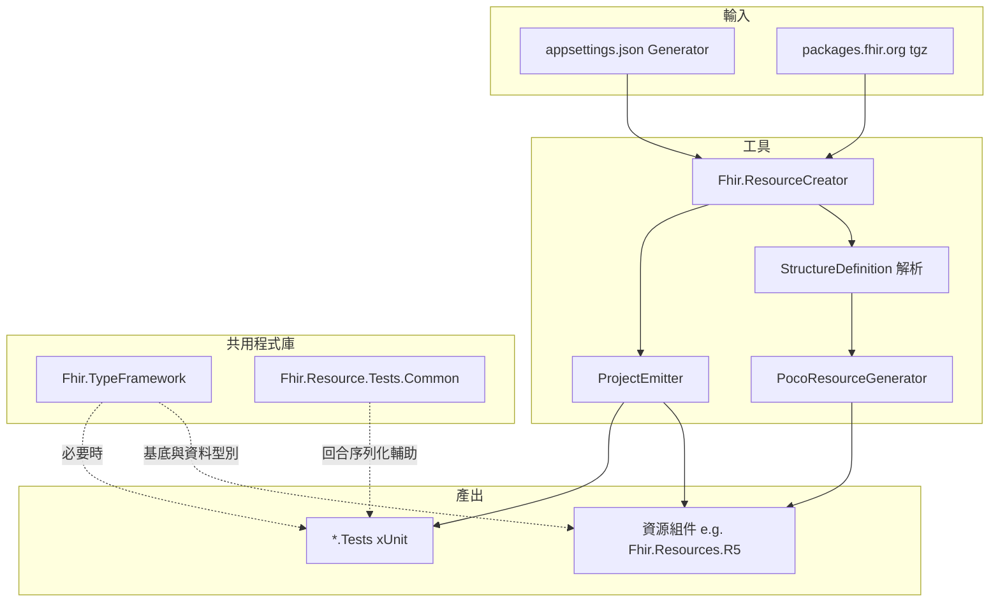

# Fhir.ResourceCreator 整體架構

## 目標

由 **FHIR Registry** 下載官方 NPM 風格套件（如 `hl7.fhir.r5.core`），解析 **StructureDefinition**（優先 `snapshot.element`），產生與 **Fhir.TypeFramework** 對齊的 **強型別 POCO**（`DomainResource` 子類別），並為每一組「套件版本」發射 **獨立資源組件專案** 與 **對應測試專案**，可於本機或 CI 中建置、`dotnet pack` 發佈 NuGet。

## 方案內角色關係

## 與 Fhir.TypeFramework 的邊界

- **單一** `Fhir.TypeFramework` NuGet：Primitives、基底類別（如 `Resource`、`DomainResource`）、通用複合型別與 `FhirJsonSerializer`。
- **依 FHIR 大版本／Registry 套件**區分的，是 **產生之資源組件**（例如 `Fhir.Resources.R5`），**不是**再拆一份「R5 專用 TypeFramework」。
- 跨 R4/R5 **共用**的程式碼應留在 TypeFramework；資源組件僅承載該套件 StructureDefinition 所定義之資源形狀。

## 管線階段（Registry 模式）

1. **設定**：讀取 `Generator` 區段（Registry URL、套件清單、`OutputRoot`、`ResourcesInclude`／`ResourcesExclude` 等）。
2. **下載與快取**：GET Registry 取得 `.tgz`，解壓至 `PackageCacheDirectory`（預設 `artifacts/fhir-packages`）。
3. **列舉 SD**：於解包目錄掃描 `*.json`，辨識 `StructureDefinition`，篩選 `kind = resource`、非 abstract、具 snapshot。
4. **元素模型**：將 `snapshot.element` 轉為內部 `ElementRecord`（與舊版 Excel 管線概念相容），經產生器輸出 C#。
5. **發射專案**：寫入 `{OutputRoot}/{OutputProjectName}/{OutputProjectName}.csproj`，並引用 TypeFramework（同 repo 時為 `ProjectReference`，否則 `PackageReference`）。
6. **測試**：於 `{OutputProjectName}.Tests` 底下依資源產生薄層 smoke 測試。

## 序列化與記憶體模型

- 記憶體內為 **可變 POCO**，與 **FhirJsonSerializer**（System.Text.Json）一致之 JSON 邊界。
- **FHIR XML** 尚未於 TypeFramework 完整實作；共用測試層預留 **線上格式編碼介面**，XML 為 stub／後續迭代。

## Excel 模式（Legacy）

`Mode: Excel` 時改走本機 `*.xlsx`（OleDb），產出語意與 Registry 主線不同，預設僅作過渡或離線情境；主線以 Registry + StructureDefinition 為準。

## 產生物理位置

預設 **`Fhir.ResourceCreator/generated/`**（相對於執行 `dotnet run` 時的工作目錄）。建議在 `Fhir.ResourceCreator` 目錄下執行工具，使相對路徑一致。

## 延伸閱讀

- [使用手冊](../guides/user-manual.md)
- [命名與發佈](../reference/naming-and-packaging.md)
- `.cursor/rules/fhir-sdk-architecture.mdc`（IDE 規則）
